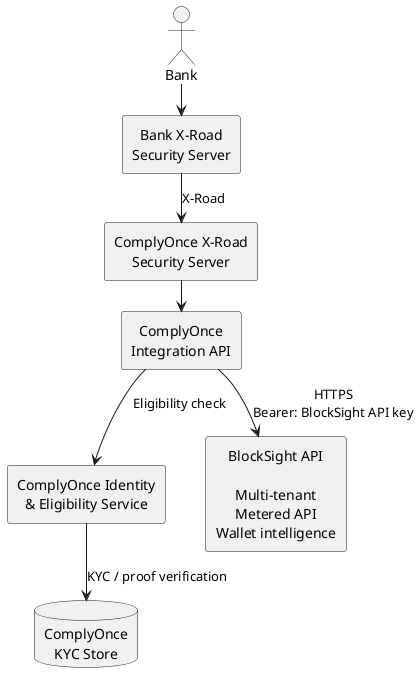
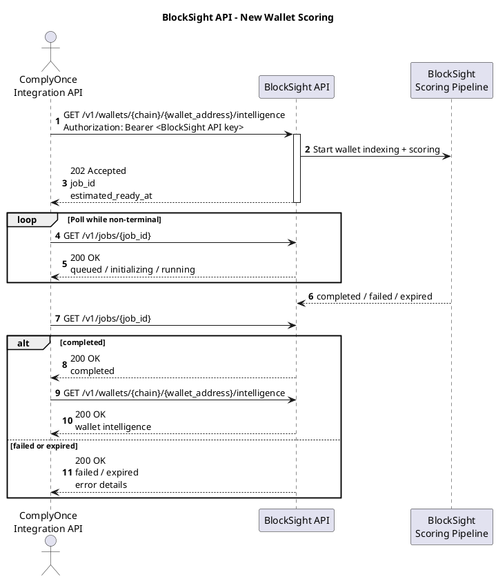
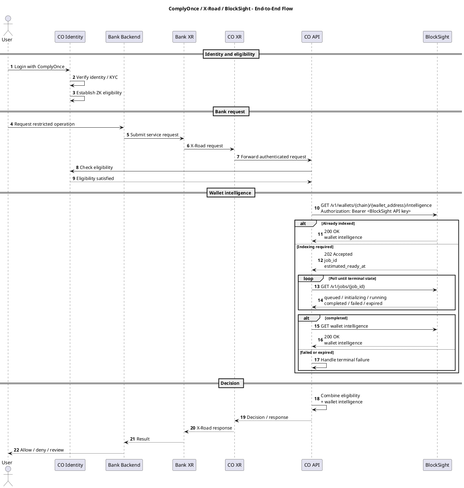

# Scope

ComplyOnce owns and operates the identity, KYC, eligibility, X-Road, and orchestration layers, including configuration and operation of its X-Road Security Server.

BlockSight provides wallet intelligence through its existing multi-tenant, metered API.

BlockSight does not host, configure, or participate directly in X-Road. BlockSight is not an X-Road member or subsystem in this integration. ComplyOnce consumes the BlockSight API as a downstream service using a BlockSight-issued server-side credential.

## System Architecture

**Integration boundary:** Bank backend to X-Road to ComplyOnce to the BlockSight API.

ComplyOnce is the BlockSight API consumer and tenant for this integration. BlockSight authentication and usage metering are performed against the ComplyOnce credential unless a separate per-bank tenancy model is agreed. Downstream banks are not BlockSight tenants and do not receive BlockSight credentials under this model.

KYC source data and zero-knowledge proof verification remain within ComplyOnce. BlockSight receives only the wallet and request context required for wallet intelligence and does not receive or verify underlying KYC evidence, zero-knowledge proofs, or witness material. ComplyOnce converts its identity and eligibility results into the final policy decision.

## BlockSight Wallet Scoring

For an already indexed wallet, BlockSight may return wallet intelligence immediately with `200 OK`. If indexing is required, BlockSight returns `202 Accepted` with a `job_id` and `estimated_ready_at`, and ComplyOnce polls the job until it reaches a terminal state: `completed`, `failed`, or `expired`. Wallet intelligence is retrieved after successful completion; ComplyOnce handles `failed` or `expired` as terminal failures.

The target initial processing time for a newly indexed wallet is **under 30 seconds**. Actual completion time may vary by chain and upstream provider conditions; `estimated_ready_at` is the API-provided estimate and is not an SLA commitment.

## End-to-End Flow

## Responsibilities

**ComplyOnce:** end-user authentication, KYC data, zero-knowledge proof verification, eligibility, X-Road infrastructure and configuration, BlockSight orchestration, and final authorization and policy decisions.

**BlockSight:** wallet ingestion, behavioral and risk intelligence, scoring, API authentication, tenant isolation, and usage metering.

BlockSight supplies intelligence to ComplyOnce; it does not make the end-user authorization decision.

**Tenant model to confirm:** one ComplyOnce BlockSight tenant and credential, or separately agreed per-bank tenancy and metering.
