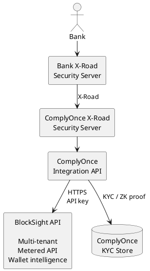
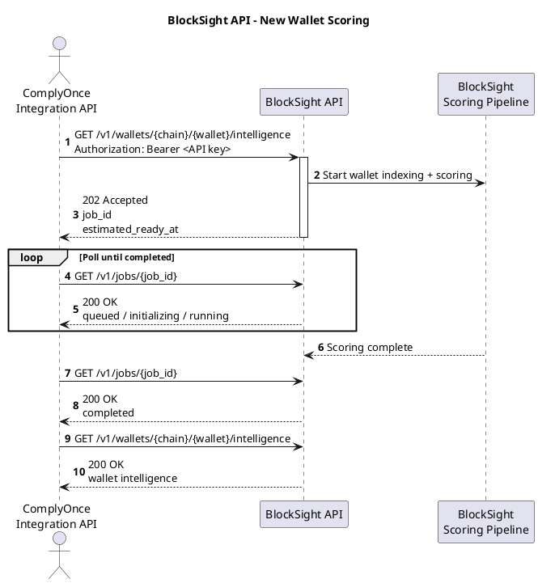
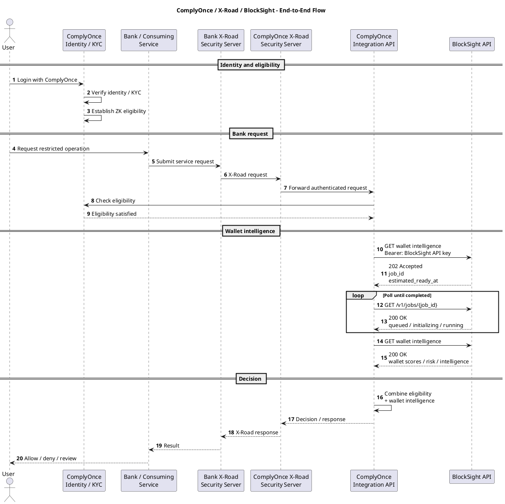

# Scope

ComplyOnce provides identity, KYC, eligibility, X-Road and orchestration.

BlockSight provides wallet intelligence through its existing multi-tenant API.

BlockSight does not host or configure X-Road.

## System Architecture

**Integration boundary:** Bank to X-Road to ComplyOnce to the BlockSight API.

KYC source data remains within ComplyOnce. BlockSight receives only the data required for wallet analysis.

## BlockSight Wallet Scoring

New-wallet scoring is asynchronous. Expected initial processing time is **under 30 seconds**, subject to chain and provider conditions. The API contract exposes `estimated_ready_at`.

## End-to-End Flow

## Responsibilities

**ComplyOnce:** identity, KYC, ZK/eligibility, X-Road, orchestration and final policy decision.

**BlockSight:** wallet ingestion, scoring, risk intelligence, API authentication, tenant isolation and metering.

This document records the intended integration boundary, subject to confirmation by both teams.
